# AdSight - Visual User Journey

A concise, pictorial guide to user flows in AdSight.

---

## 1. Complete User Journey Overview

---

## 2. Alert Workflow (Critical Path)

---

## 3. Daily Workflow by Persona

---

## 4. Campaign Details Flow

---

## 5. Rules Configuration Flow

---

## 6. Page Navigation Map

---

## 7. Real-Time Alert Example (Performance Marketer)

---

## 8. Business Owner Mobile Alert Response

```mermaid
sequenceDiagram
    participant System
    participant WhatsApp
    participant BO as Business Owner
    participant Mobile as Mobile App
    participant Team
    
    System->>System: CAC exceeds $45
    System->>WhatsApp: Send alert
    
    Note over WhatsApp: 🔴 CRITICAL<br/>CAC: $45.50<br/>Target: $30.00<br/>Revenue risk: -$12k
    
    WhatsApp->>BO: Notification arrives
    BO->>WhatsApp: Reads message
    BO->>Mobile: Clicks link
    
    Mobile->>BO: Opens alert
    Note over BO: Calculates:<br/>Not profitable!<br/>Urgent action needed
    
    BO->>Team: Call PM
    Team->>System: Pause campaign
    Team->>BO: Confirm action
    
    BO->>Mobile: Add resolution note
    BO->>Mobile: Mark resolved
    Mobile->>System: Update status
```

---

## Key Points

### Color Legend
- 🟢 **Green** - Start/Success/Completion
- 🔵 **Blue** - Dashboard/Primary screens
- 🟣 **Purple** - Campaign screens
- 🟠 **Orange** - Alerts/Warnings
- 🔴 **Red** - Critical/High priority
- 🔴 **Pink** - Persona selection

### User Actions
- **View** - Navigate to new page
- **Click** - Open modal/expand
- **Mark Resolved** - Acknowledge alert
- **Snooze** - Hide temporarily
- **Create/Edit** - Modify rules

### Notification Channels
1. **Dashboard** - Always visible
2. **Email** - Detailed notification
3. **Slack** - Instant message
4. **WhatsApp** - Mobile urgent alerts

---

## How to View These Diagrams

**GitHub/GitLab:** Renders automatically ✅

**VS Code:** Install "Markdown Preview Mermaid Support" extension

**Online:** Copy code to [mermaid.live](https://mermaid.live/)

**Export:** Convert to PNG/SVG using online tools

---

*Simplified version - Last updated: November 23, 2025*
